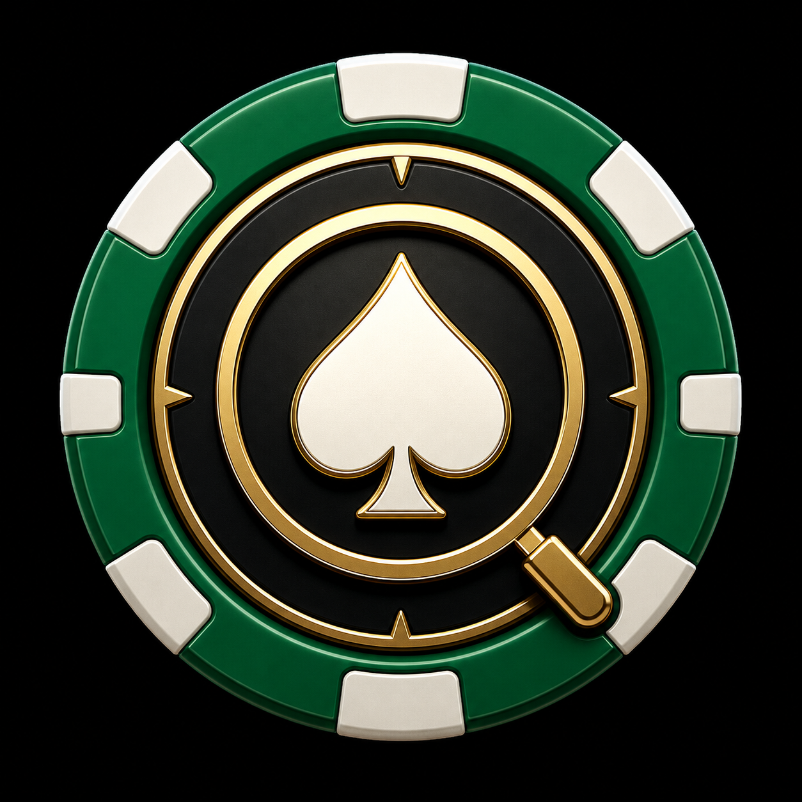
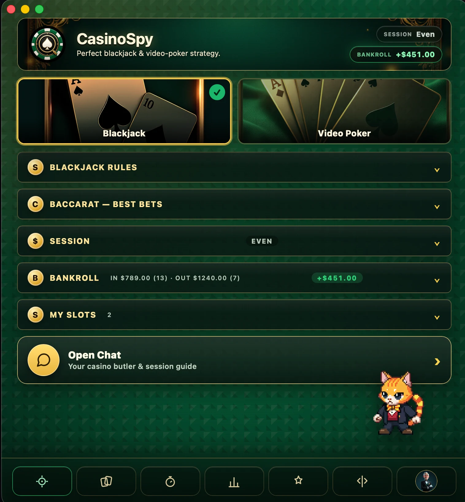

<div align="center">



# ♠ CasinoSpy

**Your casino sidekick for smarter play — strategy aid, honest tracking, and a friendly guide.**

A macOS desktop companion that helps you play smarter and stay in control. It can
watch a region of your screen and read the cards with **your local Claude Code CLI**
(Opus vision — no API key) to suggest the strongest play on a floating overlay, plus a
bankroll tracker, a live session counter, a British butler chat guide, a customisable
pixel-art companion, and a personal launcher for your favourite casino games.

> **🍁 Heads-up on the games launcher:** the "My Slots" feature is wired to
> **[OLG](https://www.olg.ca) — Ontario, Canada's** regulated online casino. If you're
> outside Ontario or prefer another operator, **fork this repo** and point the catalogue
> URL + scraper at your preferred site (see [Using a different casino](#-using-a-different-casino)).
> Everything else (overlay, bankroll, session, chat, companion) is operator-agnostic.



</div>

---

## ✨ What's inside

CasinoSpy started as a perfect-strategy overlay and grew into a full play companion.
Here's everything it does.

### 🎯 Perfect-strategy overlay
- **Pick any screen region** with a transparent spotlight selector — your blackjack
  table or your 5-card video-poker hand.
- **Local Claude Code OCR** — the cropped region is read by the `claude` CLI on your
  machine (uses your existing subscription, **no Anthropic API key**).
- **Perfect blackjack basic strategy** — configurable decks (incl. *Unlimited* for
  RNG/continuous-shuffle games), dealer hits/stands soft 17 (H17/S17),
  double-after-split, and late surrender. Correct hard/soft/pair/surrender plays with
  "can't double" fallbacks.
- **Exact-EV video poker** for all 9 IGT Game King titles, with true wild-card
  evaluation:
  - Jacks or Better, Bonus Poker, Bonus Poker Deluxe, Double Bonus,
    Double Double Bonus, Triple Double Bonus
  - **Deuces Wild, Deuces Wild Bonus, Joker Poker**
  - The solver brute-forces all 32 holds × every possible draw → the true
    maximum-EV hold (not chart-approximated).
- **Floating overlay** with real card graphics, a colour-coded move
  (HIT / STAND / DOUBLE / SPLIT / SURRENDER) or HOLD/DRAW tags, a confidence meter,
  and a full-window staged "Reading" progress (Capturing → Reading → Analyzing).
- **Two scan modes** — a Scan button + global hotkey **⌘/Ctrl + ⇧ + B**, plus an
  Auto-poll toggle for video play.

### 💰 Bankroll tracker
- Log **deposits and withdrawals**; see running **Deposited / Withdrawn / Net** totals.
- A live **net badge** in the banner stays green/red/even at a glance.

### ⏱️ Live session counter
- Start a session with a **buy-in**, then nudge your **current total** up/down (or type
  it) from a draggable, always-on-top mini window.
- Win/loss is colour-coded; **Lock in** saves the result to your **session history**.
- The same counter is reachable from the chat window with one click.

### 🎩 Ask Jiffrey — your casino butler
- An in-app chat guide powered by **your local Claude Code CLI** (Sonnet).
- Knows your **live session** (buy-in / current / win-loss) for grounded advice.
- Plays it straight: honest about negative-EV and that **slots can't be beaten** by
  strategy; explains correct blackjack / video-poker play; nudges toward limits and
  breaks, and points to OLG PlaySmart when it matters.
- Multiple saved chat threads with a history drawer.

### 🐾 Pixel-art companion
- Generate a custom **pixel-art buddy** via the [PixelLab](https://www.pixellab.ai) API
  (your key) — idle / win / lose animations stored inline.
- Lives bottom-right as ambient, click-through decoration that **reacts** to your
  session and bankroll (win pop on a withdrawal/up-tick, shake on a deposit/down-tick).
- **Customise** and **Flip** controls in the bottom nav; a full-screen **spotlight**
  showcase with a casino backdrop, light rays, and a flipping-coin logo.
- Jiffrey's chat avatar uses your buddy's sprite when you've made one.

### 🎰 My Slots — your OLG launcher
- **Open OLG Casino** in its own window.
- Browse the catalogue and hit the injected **★ Add to Favourites** button — pick a
  **category** right there (Slot / Arcade / Cards / Live).
- Or add from inside the app: **search the live OLG catalogue** (~1000 games, scraped
  server-side so there's no CORS) or **paste a game URL**.
- CasinoSpy auto-grabs the **title** and **downloads a thumbnail** preview; you can
  override the image (paste a URL or pick a file).
- Favourites show as image tiles with a category badge. **Click a card to launch the
  game** (real-money) in its own window; hover for the name and quick actions.
- **Edit** any favourite — change the image, title, link, and category. **Filter** the
  grid by category.

---

## 🛠️ Requirements

- **macOS** (Apple Silicon builds provided)
- [**Claude Code**](https://claude.com/claude-code) installed with `claude` on your PATH
  (used for both card OCR and the Jiffrey chat — your subscription, **no API key**)
- **Node 18+** and **Rust** (stable) to build
- *(Optional)* a [**PixelLab**](https://www.pixellab.ai) API key for the pixel companion

## 🚀 Run it

```bash
npm install
npm run tauri dev
```

## 📦 Build a release

```bash
npm run tauri build
```

The `.app` and `.dmg` land in `src-tauri/target/release/bundle/`. For a signed +
notarized build, add an Apple **Developer ID Application** certificate to your keychain
and set the signing env vars before building:

```bash
export APPLE_SIGNING_IDENTITY="Developer ID Application: Your Name (TEAMID)"
export APPLE_ID="you@example.com"
export APPLE_PASSWORD="app-specific-password"
export APPLE_TEAM_ID="TEAMID"
npm run tauri build
```

## 🔐 First-time macOS permissions

CasinoSpy captures the screen, so macOS will prompt for **Screen Recording** the first
time you scan (System Settings → Privacy & Security → Screen Recording). In `dev`, grant
it to your Terminal/IDE; in the built app, grant it to **CasinoSpy**, then relaunch. The
global hotkey may also need Accessibility / Input Monitoring.

## 🎮 How to use

1. Pick a **game mode** tile (Blackjack or Video Poker).
2. Set the **rules** (blackjack: decks + soft-17/DAS/surrender) or the **Game King
   title** (video poker — match the machine's posted pay table).
3. **Pick region** and drag a box around the whole hand.
4. **Open overlay**, then **Scan** (or ⌘/Ctrl+⇧+B), or toggle **Auto**. Keep the overlay
   *outside* the captured region so it isn't read.
5. Optionally: track your **bankroll**, start a **session**, ask **Jiffrey** for advice,
   make a **pixel buddy**, and build your **My Slots** launcher.

## 🗂️ Project layout

```
index.html / src/main.js          Control panel + companion + slots wiring
overlay.html / src/overlay.js     Floating strategy overlay
selector.html / src/selector.js   Screen-region picker
session.html / src/session-*.js   Live session counter window
chat.html  / src/chat.js          Ask Jiffrey butler chat
src/strategy.js                   Configurable blackjack basic-strategy engine
src/videopoker.js                 Game King video-poker exact-EV solver (wild-aware)
src/scan.js                       Parses Claude's JSON response
src/buddy.js / src/buddy-setup.js Pixel-art companion (PixelLab) + setup modal
src/pixellab.js                   PixelLab API client
src/slots.js                      My Slots favourites + OLG catalogue picker
src/settings.js                   Shared localStorage settings
src-tauri/src/lib.rs              Rust: screen capture (xcap), Claude CLI, windows,
                                  hotkey, OLG scraping (ureq), image thumbs
```

## 🔎 How it works

- **Card reading** — the Rust backend captures the selected region with
  [`xcap`](https://crates.io/crates/xcap), writes a temp PNG, and runs the local Claude
  Code CLI headlessly (`claude -p … --allowedTools Read --model opus`) to return strict
  JSON describing the cards. The strategy/EV engines are pure JavaScript and run
  instantly client-side.
- **OLG slots** — the catalogue and individual game pages are fetched **server-side in
  Rust** (`ureq`) to avoid CORS; titles come from `og:title`, preview images are
  downloaded and re-encoded to small JPEG thumbnails. The catalogue window injects a
  small "★ Add to Favourites" button that emits the pick back to the app over Tauri's
  event bus (a remote capability scoped to `olg.ca`).
- **Everything persists** in `localStorage` (shared across all windows on the same
  origin): rules, region, ledger, session + history, chats, buddy, and slots.

## 🌍 Using a different casino

The **My Slots** launcher targets **OLG (Ontario, Canada)** — its catalogue is
server-rendered and exposes demo/real play links, which makes it easy to scrape and
launch. If you're outside Ontario or want another operator:

1. **Fork this repo.**
2. In `src-tauri/src/lib.rs`, update the scrapers to your site: the catalogue URL +
   link pattern in `fetch_olg_games`, the title/image meta in `fetch_olg_game`, and the
   injected catalogue button in `OLG_FAV_SCRIPT` (the `olg.ca` host check + the
   "All Casinos" / "Add to Favourites" buttons).
3. In `src/slots.js`, change the `CATALOG` URL and the `#/demo` / `#/real` launch
   pattern to match how your operator opens games.
4. In `src-tauri/capabilities/remote.json`, swap the `olg.ca` remote URL for your host
   so the in-page button can talk to the app.

Everything else — the strategy overlay, bankroll, session counter, Jiffrey chat, and
the pixel companion — is operator-agnostic and needs no changes.

## ⚖️ Legal / responsible use

For educational and strategy-practice purposes. Casino games are **negative expected
value**, and **slots are pure RNG** — no tool or system changes their odds. Many casinos
and online operators prohibit real-time assistance tools — use only where permitted and
at your own risk. Set limits, take breaks, and see
[OLG PlaySmart](https://www.playsmart.ca) if play stops being fun.

## License

MIT
